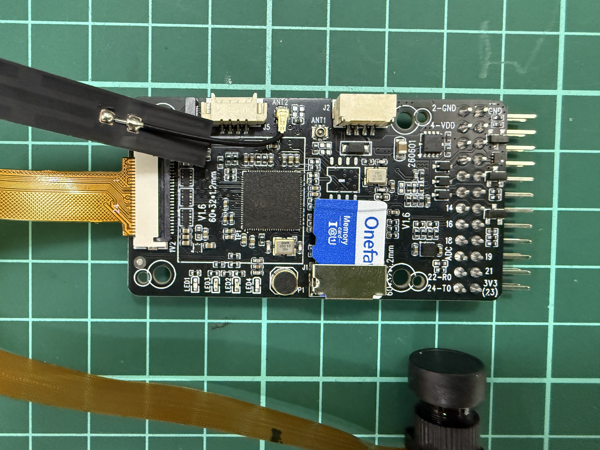
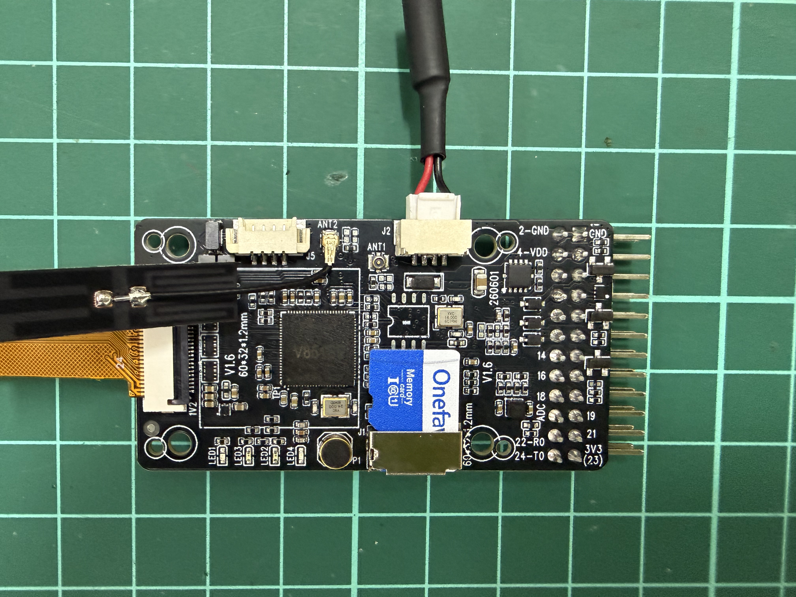
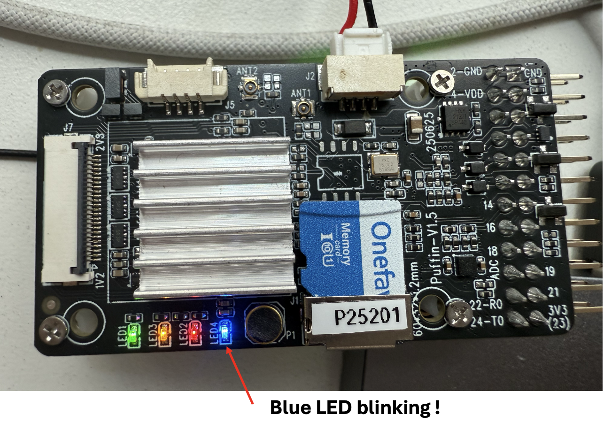
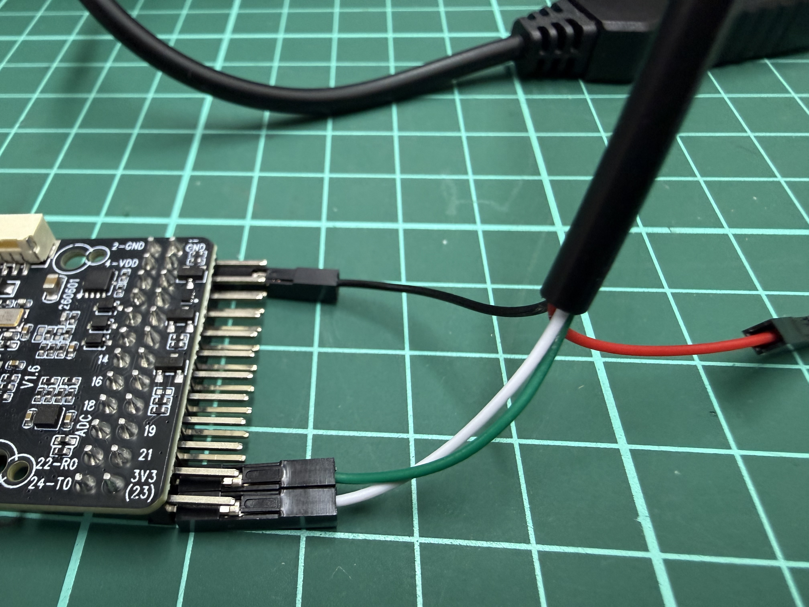
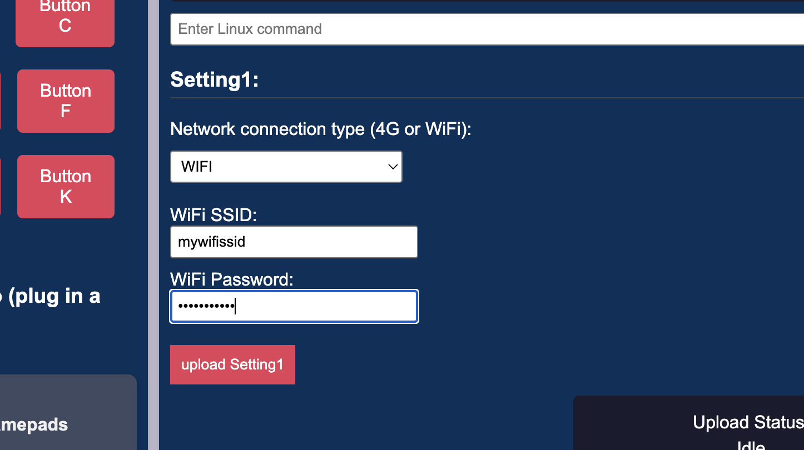
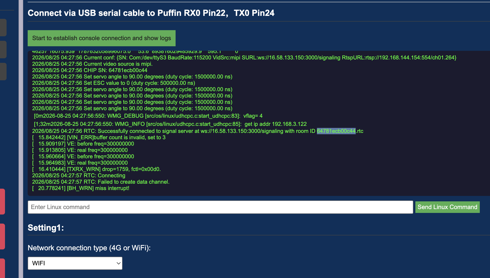
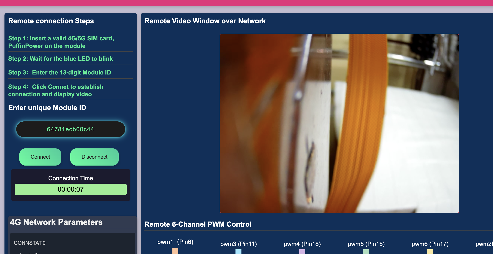

# Puffin WiFi Quick Start

Follow these steps to connect Puffin to Wi-Fi and view the live MIPI camera feed.

> [!IMPORTANT]
> **Puffin WiFi supports 2.4 GHz Wi-Fi only.**
> 5 GHz Wi-Fi networks are not supported.

## Quick Start

### Step 1 — Connect Required Accessories

1. Insert the microSD card.
2. Connect the WiFi antenna to **AT2**.
3. Connect the MIPI camera.



### Step 2 — Power On Puffin

1. Connect the Puffin power cable.
2. Wait for the board to boot and for the LEDs to begin their normal activity.



Example LED activity during startup:



### Step 3 — Connect the USB Debug Cable

Connect the USB-to-UART cable to:

- Puffin **RX0 — Pin 22**
- Puffin **TX0 — Pin 24**
- **GND**

> [!WARNING]
> **Do not connect the red power wire from the USB-UART cable.**
> Use only the signal and ground wires.



### Step 4 — Download and Open the Ground Control Panel

[Download Puffin WiFi Ground Control Panel v1.0](https://github.com/WIRELESSX-HK/Puffin_KS/releases/tag/puffin-wifi-gc-1.0)

1. Download the ZIP package.
2. Extract the ZIP package.
3. Open `Puffin-demo-panel-EN.html`.

### Step 5 — Connect to Puffin via USB Serial

1. Locate **“Connect via USB serial cable to Puffin RX0 Pin22, TX0 Pin24”**.
2. Click **“Start to establish console connection and show logs”**.
3. Select the correct USB serial port.

The serial baud rate is **115200**.

### Step 6 — Configure WiFi

> [!IMPORTANT]
> **Puffin supports 2.4 GHz Wi-Fi only.**
> 5 GHz Wi-Fi is not supported.

1. Set **Network connection type** to **WIFI**.
2. Enter the WiFi SSID.
3. Enter the WiFi Password.
4. Click **“upload Setting1”**.



> [!IMPORTANT]
> **Restart or power-cycle Puffin after uploading the WiFi settings.**

### Step 7 — Find the Module ID

After Puffin restarts, reconnect the USB serial console if necessary. Find a console line similar to:

```text
roomID 1234567890123.rtc
```



> [!IMPORTANT]
> **Copy:** `1234567890123`
>
> **Do not copy:** `.rtc`
>
> The Ground Control Panel automatically adds the `.rtc` suffix.

### Step 8 — Connect and View Live Video

1. Paste the copied Module ID into **“Enter unique Module ID”**.
2. Click **Connect**.
3. Wait several seconds.
4. Confirm that the live MIPI camera feed appears in the **Remote Video Window**.


